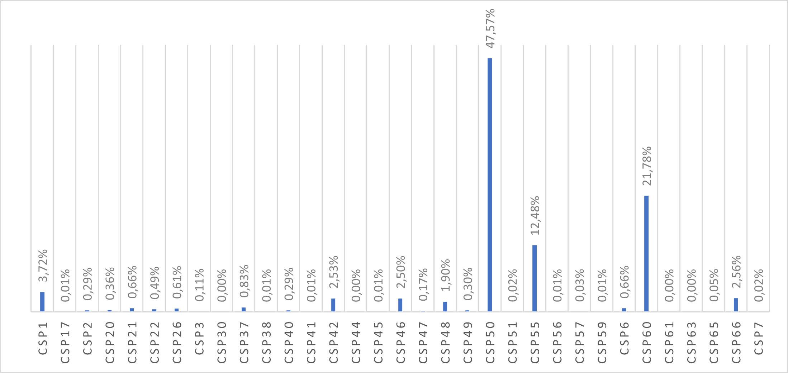
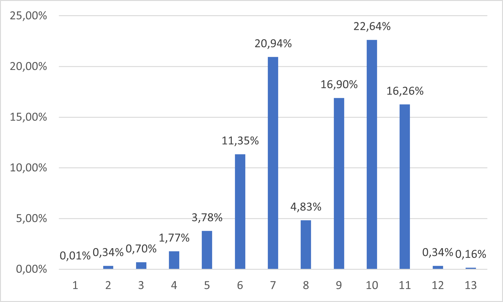

## Import Package

```{r}
library(FactoMineR)
library(factoextra)
library(CASdatasets)
library(tidyverse)
library(MASS)
library(knitr)
library(ggplot2)
library(cowplot)
library(reshape2)
library(dplyr)
library(GGally)
library(corrplot)
library(carData) 
library(car)
library(questionr)
library(multcomp)
library(dplyr)
library(leaps)
library(TeachingDemos)
library(FactoMineR)
library(factoextra)
library(ROCR)
library(plotROC)
```

# Etude CSP

# 

Une première analyse nous permet de rassembler toutes les CSP comportant moins de 1,5% des assurés dans une seule et même classe. Il s'agit des classes : CSP17,2,20,21,22,26,3,30,37,38,40,41,44,45,47,49,51,56,57,59,6,61,63,65 et 7.

La suite de notre étude ne portera donc que sur les classes :CSP1, 42, 46, 48, 50, 55, 60 et 66

```{r}
#J'ai procédé d'une autre manière. Voir encadré suivant
#On conserve que les CSP1, 42, 46, 48, 50, 55, 60 et 66

#data=subset(freMPL5,freMPL5$SocioCateg %in% c("CSP1","CSP42","CSP46","CSP48","CSP50","CSP55","CSP60","CSP66"))

```

```{r}
#On importe la base de données qu'avec les bonnes CSP après sélection sur Excel
data(freMPL5)
freMPL5 <- subset(freMPL5, freMPL5$ClaimAmount >= 0)
write.csv(freMPL5, file="databrute.csv", row.names = FALSE)
setwd("C:/Users/enceu/OneDrive/Bureau/Git_hub_Mémoire/Depot-memoire")
data=read.csv("data_CSP.csv",header=TRUE,sep=";",fill=F)
```

### I) K-Means avec les variables ClaimInd et ClaimAmount

L'objectif est de constituer différents groupes d'individus à partir de leurs caractéristiques. Ces regroupement seront faits grâce à des similitudes partagées par des mêmes individus (à partir de calcul de distance : on se servira essentiellement de la distance euclidienne dans cette étude)

Cette méthode sera utilisée pour deux variables quantitatives : Montant sinistre moyen par CSP, Fréquence de sinistres par CSP et Exposure moyen par CSP

#### a) Etude des outliers

```{r}
boxplot(data$ClaimAmount[data$ClaimInd==1] ~ data$SocioCateg[data$ClaimInd==1], ylim=c(0,15000))
```

#### b) Clustering avec contrats regroupés par CSP

Dans la suite de cette section, on va regrouper, si possible, les 8 CSP restantes grâce à la méthode des k-means

```{r}
#On centre chaque colonne de notre dataframe data afin de pouvoir procéder aux k-means 
data_1=read.csv("data_CSP_1.csv",header=TRUE,sep=";",fill=F,row.names=1)
df=scale(data_1)
#Etude du nombre de clusterings que l'on va considérer grâce à différents critères

fviz_nbclust(data_1,  FUNcluster = kmeans ,c("silhouette", "wss", "gap_stat"),k.max=7)

km.res <- kmeans(df, 2, nstart = 10)
km.res


fviz_cluster(km.res, data = df, centroids = 2, repel = TRUE, ellipse.type = "norm")
```

Ce premier clustering nous permet de constituer 2 clusters parmi ces 8 classes :

-   Cluster 1 : CSP1, 42, 46, 48 et 66

-   Cluster 2 : CSP 50, 55 et 60

#### c) Clustering avec l'entierté des contrats

```{r}
data_2=read.csv("data_3.csv",header=TRUE,sep=";",fill=F)

#On crée une nouvelle colonnes pour pouvoir mettre en nom de colonnes les CSP bien qu'il y ait redondance (R veut que chaque nom de ligne soit différent)
data_2$col_1 <- paste(rownames(data_2), data_2$SocioCateg, sep = "_")
rownames(data_2)=data_2$col_1


#On élimine les colonnes SocioCateg et col_1 qui n'ont plus d'utilité
data_2=data_2[, -c(1,11)]

#On prend n lignes de notre data set de manière aléatoire car il n'est pas possible de travailler avec les 25000 lignes (manque de puissance)

n=2500
data_2_aleatoire=sample_n(data_2, n)
```

```{r}
#On centre chaque colonne de notre dataframe data afin de pouvoir procéder aux k-means 

df_1=scale(data_2_aleatoire)
#Etude du nombre de clusterings que l'on va considérer grâce à différents critères

fviz_nbclust(data_2_aleatoire,  FUNcluster = kmeans ,c("silhouette", "wss", "gap_stat"),k.max=7)

km.res <- kmeans(df_1, 2, nstart = 10)

#On donne une couleur à chaque CSP pour mieux les visualiser au final 
data_2_aleatoire$couleur <- ifelse(grepl("CSP50", row.names(data_2_aleatoire)), "red",ifelse(grepl("CSP42", row.names(data_2_aleatoire)),"blue",ifelse( grepl("CSP46", row.names(data_2_aleatoire)),"green",ifelse(grepl("CSP48", row.names(data_2_aleatoire)),"yellow",ifelse(grepl("CSP1", row.names(data_2_aleatoire)),"black",ifelse(grepl("CSP55", row.names(data_2_aleatoire)),"orange",ifelse(grepl("CSP60", row.names(data_2_aleatoire)),"pink","purple")))))))

fviz_cluster(km.res, data = df_1, centroids = 2, repel = TRUE, ellipse.type = "norm",#palette = data_2_aleatoire$couleur
             )

x=km.res$cluster
df_x=data.frame(x)

#On crée une nouvelle colonne pour considérer que les CSP
df_x$CSP <- ifelse(grepl("CSP50", row.names(df_x)), "CSP50",ifelse(grepl("CSP42", row.names(df_x)),"CSP42",ifelse( grepl("CSP46", row.names(df_x)),"CSP46",ifelse(grepl("CSP48", row.names(df_x)),"CSP48",ifelse(grepl("CSP1", row.names(df_x)),"CSP1",ifelse(grepl("CSP55", row.names(df_x)),"CSP55",ifelse(grepl("CSP60", row.names(df_x)),"CSP60","CSP66")))))))

#On exporte ce data frame sous excel pour traiter ces données plus facilement 
setwd("C:/Users/enceu/OneDrive/Bureau/Git_hub_Mémoire/Depot-memoire")
write.csv(df_x, file="df_x.csv", row.names = FALSE)
```

Après avoir retravailler les données sur Excel, cela ne semble pas concluant : on ne parvient à regrouper les CSP ensemble comme pour l'autre méthode.

### I) K-Means avec les variables explicatives quantitatives

On se focalise sur les variables quantitatives autres que ClaimInd et ClaimAmount dans cette section. On considérera toutes les autres variables quantitatives.

```{r}
data_CSP_3=read.csv("data_CSP_3.csv",header=TRUE,sep=";",fill=F,row.names=1)

#On centre chaque colonne de notre dataframe data afin de pouvoir procéder aux k-means 
df_CSP_3=scale(data_CSP_3)
#Etude du nombre de clusterings que l'on va considérer grâce à différents critères

fviz_nbclust(data_CSP_3,  FUNcluster = kmeans ,c("silhouette", "wss", "gap_stat"),k.max=7)

km.res_CSP_3 <- kmeans(df_CSP_3, 4, nstart = 10)


fviz_cluster(km.res_CSP_3, data = df_CSP_3, centroids = 4, repel = TRUE, ellipse.type = "norm")
```

Ce premier clustering nous permet de constituer 4 clusters parmi ces 8 classes :

-   Cluster 1 : CSP1, 42 et 66

-   Cluster 2 : CSP 46 et 48

-   Cluster 3 : CSP 50 et 55

-   Cluster 4 : CSP60

Ces résultats semblent cohérent et nous serviront dans la suite du code pour réduire le nombre de modalités de cette variable.

# Etude RiskArea



Cette première étude nous permet de regrouper les RiskArea avecs moins de 1,5% des assurés : RiskArea 1, 2, 3, 12 et 13. Il ne reste alors que les RiskArea 4,5,6,7,8,9,10 et 11 à étudier. Pour se faire, nous allons utiliser les k-means. s

### Clustering avec contrats regroupés par RiskArea

#### a) ClaimAmount moyen et le nombre de sinistres moyen par RiskArea

Dans cette section, on effectue un k-means sur les variables ClaimAmount moyen par RiskArea et idem pour le nombre de sinistres moyen

```{r}

data_R_1=read.csv("data_RiskArea_1.csv",header=TRUE,sep=";",fill=F,row.names=1)

#On centre chaque colonne de notre dataframe data afin de pouvoir procéder aux k-means 
df_R_1=scale(data_R_1)
#Etude du nombre de clusterings que l'on va considérer grâce à différents critères

fviz_nbclust(data_R_1,  FUNcluster = kmeans ,c("silhouette", "wss", "gap_stat"),k.max=7)

km.res_R_1 <- kmeans(df_R_1, 4, nstart = 10)
km.res_R_1


fviz_cluster(km.res_R_1, data = df_R_1, centroids = 4, repel = TRUE, ellipse.type = "norm")
```

Cette modélisation ne semble pas concluante. Nous allons faire de même avec les variables explicatives quantitatives mises à notre disposition.

Ce clustering nous permet de regrouper les dernières RiskArea de la manière suivante :

-   Cluster 1 : RiskArea 10,11

-   Cluster 2 : RiskArea 8 et 6

-   Cluster 3 : RiskArea 5, 7 et 9

-   Cluster 4 : RiskArea 4

Ces résultats semblent cohérents.

#### c) Variables explicatives quantitatives (sans LicAge et ObtAge)

```{r}
data_R_3=read.csv("data_RiskArea_3.csv",header=TRUE,sep=";",fill=F,row.names=1)

#On centre chaque colonne de notre dataframe data afin de pouvoir procéder aux k-means 
df_R_3=scale(data_R_3)
#Etude du nombre de clusterings que l'on va considérer grâce à différents critères

fviz_nbclust(data_R_3,  FUNcluster = kmeans ,c("silhouette", "wss", "gap_stat"),k.max=7)

km.res_R_3 <- kmeans(df_R_3, 2, nstart = 10)


fviz_cluster(km.res_R_3, data = df_R_3, centroids = 3, repel = TRUE, ellipse.type = "norm")
```

#### d) Variables explicatives quantitatives (tout)

```{r}
data_R_4=read.csv("data_RiskArea_4.csv",header=TRUE,sep=";",fill=F,row.names=1)

#On centre chaque colonne de notre dataframe data afin de pouvoir procéder aux k-means 
df_R_4=scale(data_R_4)
#Etude du nombre de clusterings que l'on va considérer grâce à différents critères

fviz_nbclust(data_R_4,  FUNcluster = kmeans ,c("silhouette", "wss", "gap_stat"),k.max=7)

km.res_R_4 <- kmeans(df_R_4, 3, nstart = 10)


fviz_cluster(km.res_R_4, data = df_R_4, centroids = 3, repel = TRUE, ellipse.type = "norm")
```

Nous considérerons ce clustering pour la suite de notre étude. Il semble très cohérent.

-   Cluster 1 : RiskArea 5,6,7,8 et 9

-   Cluster 2 : RiskArea 10 et 11

-   Cluster 3 : RiskArea 4
